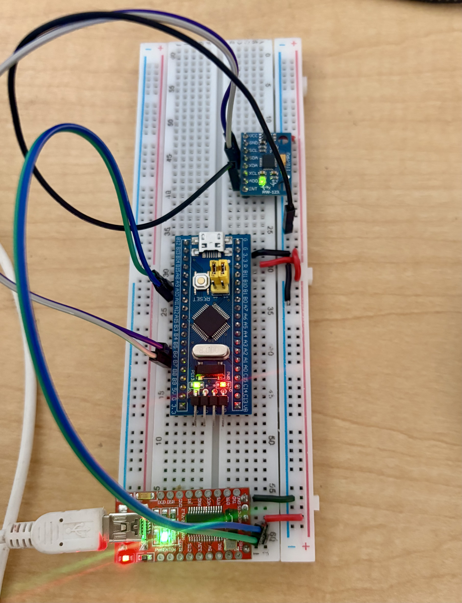
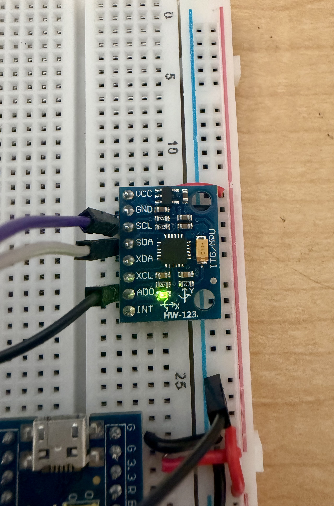
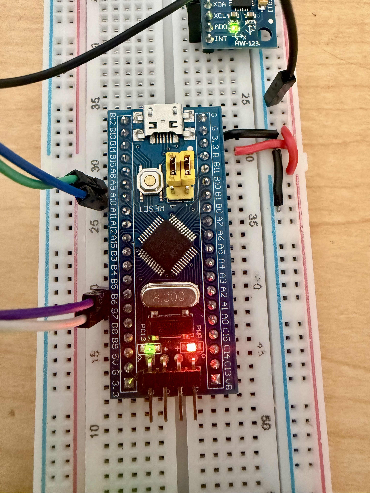
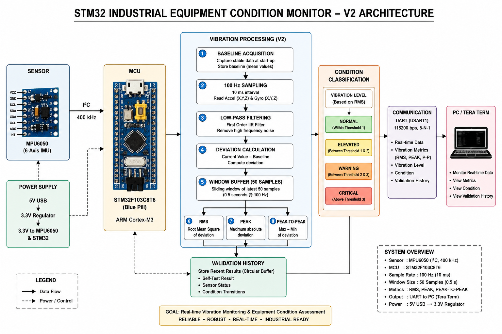
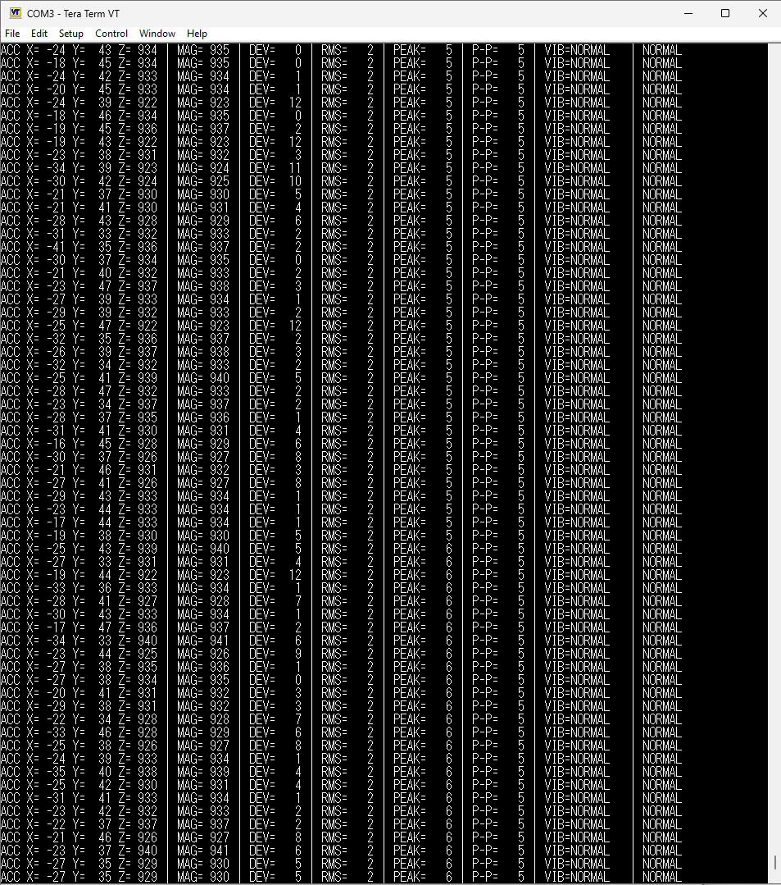
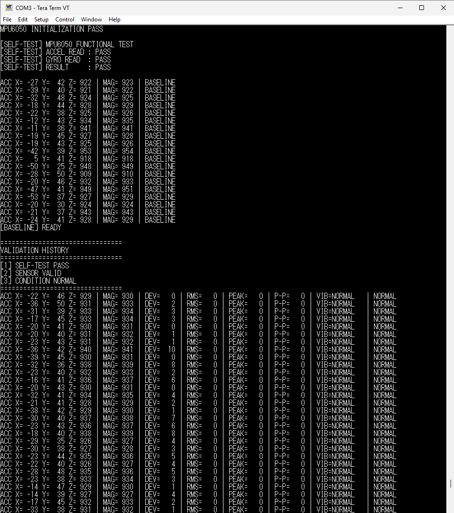
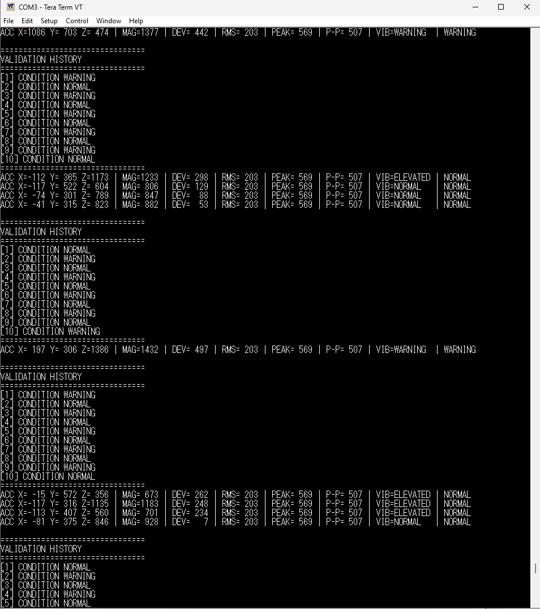

STM32 INDUSTRIAL EQUIPMENT CONDITION MONITOR
V2.0.0 DOCUMENTATION

## 1. PROJECT OVERVIEW

Project:
STM32 Industrial Equipment Condition Monitor

Version:
V2.0.0

Target MCU:
STM32F103C8T6 (Blue Pill)

Sensor:
MPU6050 6-axis accelerometer/gyroscope

Primary communication:
I2C between MPU6050 and STM32
UART from STM32 to PC / Tera Term

Purpose:
Real-time equipment-condition monitoring using vibration-related
accelerometer data and firmware-based condition classification.

V2 is an extension of the frozen V1.0.0 baseline.
V1.0.0 is preserved and must not be modified.

## 2. V2 KEY FEATURES

V2 adds the following major capabilities over V1:

- MPU6050 I2C device validation
- MPU6050 WHO_AM_I verification
- MPU6050 initialization verification
- Integrated accelerometer functional self-test
- Integrated gyroscope functional self-test
- Baseline acquisition
- Vibration deviation calculation
- 100 Hz vibration acquisition
- Low-pass vibration filtering
- 50-sample vibration analysis window
- RMS vibration metric
- Peak vibration metric
- Peak-to-Peak vibration metric
- UART display of vibration metrics
- Vibration condition classification
- Validation history logging
- Controlled NORMAL / ELEVATED / WARNING / CRITICAL states

## 3. V2 HARDWARE

Main hardware:

- STM32F103C8T6 Blue Pill
- MPU6050 module
- I2C wiring between STM32 and MPU6050
- USB-to-UART interface for PC monitoring
- Breadboard
- Jumper wires
- ST-LINK for programming/debugging

The MPU6050 provides accelerometer and gyroscope measurements.
The STM32 processes the sensor data and reports the result over UART.

## 4. V2 SYSTEM ARCHITECTURE

Signal/data flow:

MPU6050
   |
   | I2C
   v
STM32F103C8T6
   |
   +--> Baseline Acquisition
   |
   +--> 100 Hz Sampling
   |
   +--> Low-Pass Filtering
   |
   +--> Vibration Deviation
   |
   +--> RMS
   |
   +--> Peak
   |
   +--> Peak-to-Peak
   |
   +--> Condition Classification
   |       |
   |       +--> NORMAL
   |       +--> ELEVATED
   |       +--> WARNING
   |       +--> CRITICAL
   |
   v
UART
   |
   v
PC / Tera Term

## 5. SENSOR VALIDATION

At startup the firmware validates the MPU6050.

Expected startup sequence:

MPU6050 I2C PASS - WHO_AM_I = 0x68
MPU6050 INITIALIZATION PASS

[SELF-TEST] MPU6050 FUNCTIONAL TEST
[SELF-TEST] ACCEL READ : PASS
[SELF-TEST] GYRO READ  : PASS
[SELF-TEST] RESULT     : PASS

This confirms:

## 1. The MPU6050 responds over I2C.

## 2. The device identity is correct.

## 3. MPU6050 initialization completed successfully.

## 4. Accelerometer data can be read.

## 5. Gyroscope data can be read.

## 6. BASELINE ACQUISITION

At startup the system collects a baseline from the stationary
equipment.

Example:

ACC X= -25 Y= 41 Z= 941 | MAG= 942 | BASELINE
...
[BASELINE] READY

The baseline represents the normal stationary acceleration
magnitude used by the firmware for subsequent deviation
calculation.

After baseline acquisition, the firmware changes from BASELINE
operation to condition monitoring.

## 7. VIBRATION PROCESSING

V2 uses a 100 Hz vibration acquisition rate.

Sampling configuration:

VIBRATION_SAMPLE_RATE_HZ = 100
VIBRATION_WINDOW_SIZE    = 50

Therefore one vibration analysis window contains 50 samples.

V2 also applies a low-pass filtering stage before storing the
processed vibration samples.

The processing chain is:

Raw acceleration
        |
        v
Acceleration magnitude
        |
        v
Baseline comparison
        |
        v
Vibration deviation
        |
        v
Low-pass filtering
        |
        v
50-sample analysis window
        |
        +--> RMS
        +--> Peak
        +--> Peak-to-Peak

## 8. VIBRATION METRICS

V2 reports three window-based vibration metrics.

RMS:
Represents the overall energy level of the vibration signal.

Peak:
Represents the largest filtered vibration magnitude in the
analysis window.

Peak-to-Peak:
Represents the difference between the maximum and minimum
filtered vibration values in the window.

Example UART output:

RMS=176 | PEAK=397 | P-P=396

Another example:

RMS=361 | PEAK=783 | P-P=767

These values become available after the vibration analysis
window has accumulated enough samples.

## 9. CONDITION CLASSIFICATION

V2 classifies vibration deviation into condition states.

NORMAL:
Normal equipment condition.

ELEVATED:
Vibration deviation is above the normal vibration threshold
but below the warning threshold.

WARNING:
Vibration deviation reaches the warning threshold.

CRITICAL:
Vibration deviation reaches the critical threshold.

The UART output includes both the vibration state and the
overall condition classification.

Example:

DEV= 178 | VIB=ELEVATED | NORMAL

Example:

DEV=1105 | RMS=176 | PEAK=397 | P-P=396 |
VIB=CRITICAL | CRITICAL

## 10. VALIDATION HISTORY

V2 maintains a validation history of condition transitions.

Example:

VALIDATION HISTORY
[1] SELF-TEST PASS
[2] SENSOR VALID
[3] CONDITION NORMAL
[4] CONDITION WARNING
[5] CONDITION CRITICAL
[6] CONDITION NORMAL

This allows the operator to see the sequence of detected
equipment-condition changes.

## 11. V2 VALIDATION TEST

The final V2 hardware validation uses a controlled sequence:

NORMAL
   ->
VIBRATION
   ->
WARNING / CRITICAL
   ->
NORMAL

The purpose is to verify that:

- The sensor remains valid.
- Baseline operation completes.
- Normal vibration is classified as NORMAL.
- Increased vibration produces ELEVATED/WARNING behavior.
- Strong vibration produces CRITICAL behavior.
- The system returns to NORMAL after the disturbance.
- RMS, Peak and Peak-to-Peak metrics are generated.
- Validation history records condition transitions.

## 12. REPRESENTATIVE UART RESULTS

Normal:

ACC X= -17 Y= 48 Z= 927 | MAG= 928 | DEV=   0 |
RMS=   0 | PEAK=   0 | P-P=   0 | VIB=NORMAL | NORMAL

Elevated:

ACC X=  50 Y=  -2 Z=1134 | MAG=1135 | DEV=195 |
VIB=ELEVATED | NORMAL

Warning:

ACC X= -17 Y=-11 Z=485 | MAG=485 | DEV=455 |
VIB=WARNING | WARNING

Critical:

ACC X= -45 Y=-341 Z=152 | MAG=376 | DEV=559 |
RMS=361 | PEAK=783 | P-P=767 |
VIB=CRITICAL | CRITICAL

## 13. V1 TO V2 DIFFERENCE

V1 primarily provided:

- MPU6050 I2C communication
- Sensor initialization
- Accelerometer/gyroscope read validation
- Baseline acquisition
- Basic vibration deviation
- Basic condition classification
- UART reporting
- Validation history

V2 adds:

- 100 Hz vibration acquisition
- Low-pass vibration filtering
- Dedicated vibration sample buffer
- 50-sample analysis window
- RMS calculation
- Peak calculation
- Peak-to-Peak calculation
- UART output of vibration metrics
- Improved vibration sample ordering
- Improved vibration processing state
- Expanded vibration validation capability

V2 therefore moves the project from basic threshold-based
condition monitoring toward a more structured vibration-analysis
firmware implementation.

## 14. V2 GIT / RELEASE STATUS

Git repository:
STM32-Industrial-Equipment-Condition-Monitor

Release tag:
v2.0.0

V1 baseline:
v1.0.0

V2 release:
v2.0.0

Important:
V1.0.0 remains the frozen baseline.
V2 development is maintained separately from V1.

## 15. V2 DOCUMENTATION IMAGES

The following images document the V2 hardware, architecture, startup validation, normal operation, and vibration-warning behavior.

Documentation/V2/Images/

## 16. FIRMWARE BUILD STATUS

Latest verified V2 build:

Build result:
0 errors
0 warnings

Target:
STM32_Equipment_Condition_Monitor_V2.elf

The firmware was successfully built using STM32CubeIDE and
ARM GCC for the STM32F103C8T6 target.

## 17. PORTFOLIO SUMMARY

V2 demonstrates:

- STM32 embedded firmware development
- STM32 HAL usage
- I2C sensor interfacing
- MPU6050 validation
- Embedded self-test
- Accelerometer data processing
- Baseline calibration
- Digital low-pass filtering
- Fixed-rate sampling
- Windowed vibration analysis
- RMS / Peak / Peak-to-Peak metrics
- Threshold-based condition monitoring
- UART diagnostics
- Validation history
- Git version control
- Hardware and firmware validation methodology

V2.0.0 represents the completed second firmware phase of the
STM32 Industrial Equipment Condition Monitor project.
